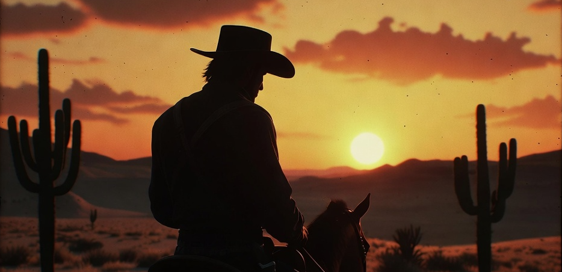

<div align="center">

**[]()**




# Dust & Reckoning

*"Every man on this train is running from something. Most of them don't know it yet."*

[](https://unity.com)
[](https://learn.microsoft.com/en-us/dotnet/csharp/)
[](https://developer.apple.com/ios/)
[](https://developer.apple.com/ipados/)
[](https://www.fmod.com)
[](https://yarnspinner.dev)
[](https://git-lfs.com)
[](https://github.com/features/actions)

[](https://anthropic.com)

**Live at [Razor Sharp Games](https://razorsharpgames.com)**

A narrative open-world western RPG set in Wyoming Territory, 1862. Built for ultimate mobile experience on iPad and iOS with Unity.

</div>

---

## Table of contents

- [Overview](#overview)
- [Story premise](#story-premise)
- [MVP scope](#mvp-scope)
- [Tech stack](#tech-stack)
- [Getting started](#getting-started)
- [Project structure](#project-structure)
- [Branching strategy](#branching-strategy)
- [Asset pipeline](#asset-pipeline)
- [Audio system](#audio-system)
- [Coding conventions](#coding-conventions)
- [Scene naming conventions](#scene-naming-conventions)
- [Contributing](#contributing)
- [Roadmap](#roadmap)
- [License](#license)

---

## Overview

Dust & Reckoning is a story-driven open-world western for mobile (iOS / iPadOS). Players control **Elias Cole**, a disgraced Pinkerton agent who arrives in the fictional town of **Blackwood, Wyoming** carrying a sealed envelope and a past he can't outrun.

The game features:
- Branching dialogue with persistent NPC memory
- Four independent reputation meters (Law, Outlaws, Townsfolk, Shoshone)
- Open-world horse riding with dynamic day/night cycles
- Investigation mechanics: an evidence journal that connects clues in real time
- Adaptive western score via FMOD Studio

---

## Story premise

**Act I — Blackwood (MVP)**
Elias steps off the Pacific Express into a boom town bristling with railroad money and barely-contained violence. A sealed envelope in his coat is addressed to a man named Caleb Marsh — who was found dead two days ago.

**Act II — Red Mesa Flats** *(post-MVP)*
The investigation expands. A second letter arrives, this one addressed to Elias — from someone called "The Widow" who knows why he was really sent to Blackwood.

Full story bible: [`/Docs/Story/STORY_BIBLE.md`](Docs/Story/STORY_BIBLE.md)

---

## MVP scope

Act I consists of three chapters:

| Chapter | Title | Location | Status |
|---------|-------|----------|--------|
| 1 | Arrival at Blackwood | Blackwood Station | 🔲 Not started |
| 2 | The Sawdust & Rye | Blackwood Saloon | 🔲 Not started |
| 3 | Dead Man's Errand | Harrow Mine outskirts | 🔲 Not started |

MVP deliverables:
- Playable tutorial (Ch. 1) with full movement, dialogue, and interaction systems
- One rideable horse with stamina and loyalty systems
- One boss encounter (Two-Bit Terrence)
- Reputation system foundation (all four factions tracked)
- Core audio loop (ambient, dialogue, combat, adaptive score)

---

## Tech stack

| Layer | Technology |
|-------|-----------|
| Engine | Unity 2023 LTS |
| Render pipeline | Universal Render Pipeline (URP) |
| Language | C# (.NET Standard 2.1) |
| Physics | Unity PhysX |
| Animation | Unity Animator + Timeline |
| VFX | Unity VFX Graph |
| Audio | FMOD Studio 2.x (via FMOD Unity integration) |
| Dialogue | Yarn Spinner 3.x |
| Asset source | Unity Asset Store + Adobe Substance / Megascans |
| Version control | Git + GitHub (Git LFS for binary assets) |
| CI | GitHub Actions |
| Target platforms | iOS 16+ / iPadOS 16+ |

---

## Getting started

### Prerequisites

- Unity 2023 LTS (via Unity Hub)
- FMOD Studio 2.x ([fmod.com](https://www.fmod.com/))
- Git with Git LFS installed
- Xcode 15+ (for iOS builds)

### Setup

```bash
# 1. Clone the repo (LFS objects included)
git clone https://github.com/your-org/dust-and-reckoning.git
cd dust-and-reckoning
git lfs pull

# 2. Open in Unity Hub
#    File → Open Project → select this folder
#    Unity version: 2023 LTS (auto-prompted if not installed)

# 3. Install FMOD Unity integration
#    Window → Package Manager → Add from disk
#    Select: /ThirdParty/FMOD/fmodstudio.unitypackage

# 4. Open the bootstrap scene
#    Assets/Scenes/Core/Bootstrap.unity
#    Press Play — the game loads from Bootstrap into the Main Menu
```

> **Note:** Never open a chapter scene directly. Always start from `Bootstrap.unity` to ensure game state managers initialize correctly.

---

## Project structure

```
dust-and-reckoning/
│
├── Assets/
│   ├── Art/                        # All visual source assets
│   │   ├── Characters/             # Character meshes, rigs, blend shapes
│   │   │   ├── Elias/
│   │   │   ├── June/
│   │   │   ├── NPCs/
│   │   │   └── Enemies/
│   │   ├── Environment/            # World geometry and props
│   │   │   ├── Blackwood/          # Act I town assets
│   │   │   ├── RedMesa/            # Act II terrain assets
│   │   │   ├── SharedProps/        # Reusable across all locations
│   │   │   └── Terrain/            # Terrain layers, splat maps, heightmaps
│   │   ├── UI/                     # UI sprites, fonts, icons
│   │   ├── VFX/                    # VFX Graph assets (dust, fire, smoke)
│   │   └── Skyboxes/               # HDRI sky assets per time-of-day
│   │
│   ├── Audio/                      # Audio assets and FMOD integration
│   │   ├── FMOD/                   # FMOD Studio project banks (.bank files)
│   │   │   ├── Master.bank
│   │   │   ├── Master.strings.bank
│   │   │   ├── Music.bank
│   │   │   ├── SFX.bank
│   │   │   └── Dialogue.bank
│   │   └── Raw/                    # Source WAV/AIFF files (Git LFS)
│   │
│   ├── Dialogue/                   # Yarn Spinner dialogue scripts
│   │   ├── Act1/
│   │   │   ├── Ch1_TrainCar.yarn
│   │   │   ├── Ch1_Platform.yarn
│   │   │   ├── Ch2_Saloon.yarn
│   │   │   └── Ch3_Mine.yarn
│   │   └── Shared/                 # Reusable dialogue nodes and functions
│   │
│   ├── Prefabs/                    # Reusable Unity prefabs
│   │   ├── Characters/
│   │   ├── Environment/
│   │   ├── UI/
│   │   ├── Gameplay/               # Horse, weapons, interactables
│   │   └── Systems/                # Manager prefabs (GameManager, AudioManager, etc.)
│   │
│   ├── Scenes/
│   │   ├── Core/
│   │   │   ├── Bootstrap.unity     # Entry point — initializes all managers
│   │   │   └── MainMenu.unity
│   │   ├── Act1/
│   │   │   ├── A1_C1_BlackwoodStation.unity
│   │   │   ├── A1_C2_SaloonAndHotel.unity
│   │   │   └── A1_C3_HarrowMine.unity
│   │   ├── Act2/                   # Placeholder scenes (post-MVP)
│   │   └── Shared/
│   │       ├── WorldMap.unity
│   │       └── LoadingScreen.unity
│   │
│   ├── Scripts/                    # All C# source code
│   │   ├── Core/                   # Game-wide systems
│   │   │   ├── GameManager.cs
│   │   │   ├── SceneLoader.cs
│   │   │   ├── SaveSystem.cs
│   │   │   └── EventBus.cs
│   │   ├── Player/
│   │   │   ├── PlayerController.cs
│   │   │   ├── PlayerCamera.cs
│   │   │   ├── HorseController.cs
│   │   │   └── PlayerInventory.cs
│   │   ├── NPC/
│   │   │   ├── NPCBrain.cs         # Base NPC state machine
│   │   │   ├── NPCScheduler.cs     # Day/night schedule system
│   │   │   ├── NPCMemory.cs        # Per-NPC conversation history
│   │   │   └── DialogueTrigger.cs
│   │   ├── Combat/
│   │   │   ├── CombatManager.cs
│   │   │   ├── WeaponBase.cs
│   │   │   ├── Revolver.cs
│   │   │   └── StealthSystem.cs
│   │   ├── Reputation/
│   │   │   ├── ReputationManager.cs
│   │   │   └── FactionData.cs      # ScriptableObject definitions per faction
│   │   ├── Investigation/
│   │   │   ├── EvidenceJournal.cs
│   │   │   ├── ClueObject.cs
│   │   │   └── ConnectionGraph.cs  # Links clues to reveal deductions
│   │   ├── World/
│   │   │   ├── DayNightCycle.cs
│   │   │   ├── WeatherSystem.cs
│   │   │   └── WorldStateManager.cs
│   │   ├── Audio/
│   │   │   ├── AudioManager.cs
│   │   │   ├── FMODEventEmitter.cs
│   │   │   └── MusicStateController.cs  # Drives FMOD parameter changes
│   │   ├── UI/
│   │   │   ├── HUD.cs
│   │   │   ├── DialogueUI.cs
│   │   │   ├── JournalUI.cs
│   │   │   ├── ReputationUI.cs
│   │   │   └── MobileInputHandler.cs
│   │   └── Utilities/
│   │       ├── Extensions.cs
│   │       ├── ObjectPool.cs
│   │       └── DebugConsole.cs
│   │
│   ├── ScriptableObjects/          # Data-driven game configuration
│   │   ├── Characters/             # Character stats, personality flags
│   │   ├── Factions/               # Faction definitions and thresholds
│   │   ├── Items/                  # Inventory item definitions
│   │   └── Quests/                 # Quest and objective data
│   │
│   ├── Settings/                   # Unity project settings tracked in git
│   │   ├── URPAsset_Mobile.asset   # URP config tuned for mobile
│   │   └── InputSystem.inputactions
│   │
│   └── ThirdParty/                 # Vendored third-party packages
│       ├── FMOD/
│       ├── YarnSpinner/
│       └── DOTween/
│
├── Docs/                           # Project documentation
│   ├── Story/
│   │   ├── STORY_BIBLE.md
│   │   ├── Characters/
│   │   │   ├── EliasCole.md
│   │   │   ├── JuneWhitehorse.md
│   │   │   ├── HarlanDross.md
│   │   │   └── TheWidow.md
│   │   └── Acts/
│   │       ├── Act1_Blackwood.md
│   │       └── Act2_RedMesa.md
│   ├── Design/
│   │   ├── GDD.md                  # Game Design Document (living document)
│   │   ├── DialogueSystem.md
│   │   ├── ReputationSystem.md
│   │   ├── CombatDesign.md
│   │   └── MobileUX.md
│   ├── Tech/
│   │   ├── ARCHITECTURE.md         # System architecture overview
│   │   ├── SaveFormat.md           # Save file schema
│   │   ├── AudioPipeline.md        # FMOD setup and parameter map
│   │   └── BuildProcess.md         # iOS build steps and signing
│   └── Art/
│       ├── StyleGuide.md           # Visual tone, palette, reference images
│       └── AssetSpec.md            # Poly budgets, texture sizes, LOD rules
│
├── ProjectSettings/                # Unity auto-generated (tracked in git)
├── Packages/                       # Unity Package Manager manifest
│
├── .github/
│   ├── workflows/
│   │   ├── build-ios.yml           # CI: build + test on push to main
│   │   └── lint.yml                # CI: code style checks
│   ├── ISSUE_TEMPLATE/
│   │   ├── bug_report.md
│   │   └── feature_request.md
│   └── PULL_REQUEST_TEMPLATE.md
│
├── .gitignore                      # Unity-specific ignores
├── .gitattributes                  # Git LFS rules for binary assets
└── README.md                       # This file
```

---

## Branching strategy

We use a simplified **GitHub Flow** adapted for game development:

```
main                    ← stable, always builds and runs
  └── dev               ← integration branch, merged to main each milestone
        ├── feature/dialogue-system
        ├── feature/horse-controller
        ├── feature/reputation-mvp
        ├── fix/camera-clipping-ios
        └── content/ch1-blackwood-station
```

| Branch prefix | Purpose |
|---------------|---------|
| `feature/` | New gameplay systems |
| `content/` | Scene work, dialogue, level design |
| `fix/` | Bug fixes |
| `refactor/` | Code cleanup with no behavior change |
| `art/` | Asset imports and material updates |

Rules:
- Never commit directly to `main`
- All merges to `main` require a passing CI build
- Scene files (`.unity`) must not be modified by two people simultaneously — coordinate in issues first

---

## Asset pipeline

### Sourcing assets

| Asset type | Source | Notes |
|-----------|--------|-------|
| Terrain, rocks, wood, soil | Adobe Megascans (via Bridge) | Export at 2K for mobile |
| Character base meshes | Unity Asset Store | Customize in Blender |
| Vegetation | Unity Terrain Tools + SpeedTree | LOD 3 max on mobile |
| Western props | Unity Asset Store | Target <2K tris per prop |

### Poly and texture budgets (mobile)

| Object class | Max triangles | Texture size |
|-------------|---------------|-------------|
| Main character (Elias) | 15,000 | 2048×2048 |
| NPC (background) | 3,000 | 512×512 |
| Horse | 12,000 | 2048×2048 |
| Environment prop | 2,000 | 1024×1024 |
| Terrain chunk | 65,000 | 2048 splat map |

### Naming convention

```
[Category]_[Name]_[Variant]_[LOD]
Examples:
  CH_Elias_Coat_LOD0.fbx
  ENV_BarrelOak_Broken_LOD1.fbx
  UI_DialogueBox_Active.png
  VFX_DustCloud_Large.prefab
```

---

## Audio system

Dust & Reckoning uses **FMOD Studio** for all audio. Unity's built-in audio system is disabled.

### Bank structure

| Bank | Contents |
|------|---------|
| `Master` | Bootstrapped on game start, never unloaded |
| `Music` | Adaptive score — stems per intensity state |
| `SFX` | Footsteps, weapons, environment, horse |
| `Dialogue` | All voiced or captioned NPC/player lines |

### Music state machine

The adaptive score listens to a single FMOD parameter `GameIntensity` (0.0–1.0):

```
0.0  →  Ambient exploration (sparse guitar, wind, distant train)
0.4  →  Tension (low strings, unsettled rhythm)
0.7  →  Confrontation (full percussion, driving brass)
1.0  →  Combat (full score, maximum intensity)
```

`MusicStateController.cs` drives this parameter based on combat proximity, reputation state, and scripted story beats.

---

## Coding conventions

- Follow [Microsoft C# coding conventions](https://learn.microsoft.com/en-us/dotnet/csharp/fundamentals/coding-style/coding-conventions)
- One class per file; filename matches class name
- `MonoBehaviour` classes: no logic in `Update()` heavier than a conditional check — delegate to managers
- All game events go through `EventBus.cs` — no direct cross-system references
- `ScriptableObjects` for all data that designers might tune — no magic numbers in code
- Coroutines only for time-based sequences; async/await for I/O (save, load)

```csharp
// Good — event-driven, no hard coupling
EventBus.Publish(new ReputationChangedEvent(Faction.Law, delta: -10));

// Bad — direct reference, tight coupling
FindObjectOfType<ReputationManager>().ChangeLaw(-10);
```

---

## Scene naming conventions

```
Bootstrap.unity             ← always the entry point
MainMenu.unity
A1_C1_BlackwoodStation      ← Act number _ Chapter number _ Location name
A1_C2_SaloonAndHotel
A1_C3_HarrowMine
A2_C4_RedMesaFlats
WorldMap.unity
LoadingScreen.unity
```

---

## Roadmap

### Milestone 1 — Foundation (Weeks 1–4)
- [ ] Unity project setup with URP mobile config
- [ ] Git LFS configured, `.gitattributes` set
- [ ] Bootstrap scene + scene loading system
- [ ] Player controller (on foot) — movement, camera, interaction
- [ ] Placeholder Blackwood Station blockout

### Milestone 2 — Act I Tutorial (Weeks 5–10)
- [ ] Chapter 1 fully playable (train car → platform)
- [ ] Dialogue system (Yarn Spinner) integrated
- [ ] NPC brain + scheduler (3 NPCs minimum)
- [ ] Reputation system (all 4 factions, UI visible)
- [ ] FMOD integration — ambient + music state machine

### Milestone 3 — Act I Complete (Weeks 11–18)
- [ ] Chapters 2 and 3 playable end-to-end
- [ ] Horse controller with stamina and loyalty
- [ ] Combat system (stealth + direct)
- [ ] Boss encounter: Two-Bit Terrence
- [ ] Evidence journal with clue connection UI
- [ ] iOS build — TestFlight ready

### Post-MVP
- [ ] Act II: Red Mesa Flats (Chapters 4–5)
- [ ] Voice acting integration
- [ ] Localization framework
- [ ] App Store submission

---

## Contributing

This is a solo/small-team project. Before starting any significant work:

1. Open an issue describing what you're building
2. Get confirmation before modifying shared scenes
3. Never commit binary assets without Git LFS tracking configured
4. Run the project in Play mode before opening a PR — it should start without errors

---

## License

Copyright © 2024. All rights reserved. Source code in this repository is proprietary and not licensed for reuse or redistribution without explicit written permission.

Assets sourced from third-party marketplaces remain subject to their original licenses (see `ThirdParty/` subdirectories for individual license files).
